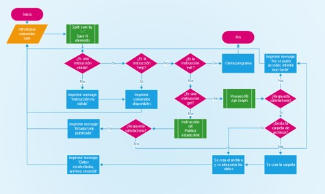

# fbcmd4j
Curso Computación con Java - Evidencia de aprendizaje. 
Este programa puede consultar tu cuenta de Facebook y obtener noticias, publicaciones y publicar mensajes y links.

El programa hace uso de la libreria facebook4j, una librería no oficial para Java que ayuda a la conexión con el sistema de Facebook.

# Aplicación

Main: Es la clase principal, contiene todos los métodos y la lógica para el funcionamiento del programa. 
facebook4j-core-2.4.13.jar: Es la librería con la que realizamos las transacciones entre nuestra aplicación y el sistema de facebook. 
&nbsp;&nbsp;&nbsp;&nbsp;&nbsp;Se realiza el uso de los siguientes métodos: 
&nbsp;&nbsp;&nbsp;&nbsp;&nbsp;&nbsp;&nbsp;&nbsp;&nbsp;&nbsp;- getHome(): Obtiene las publicaciones de tu muro.
&nbsp;&nbsp;&nbsp;&nbsp;&nbsp;&nbsp;&nbsp;&nbsp;&nbsp;&nbsp;- getFeed(): Obtiene las noticias publicadas en tu muro.
&nbsp;&nbsp;&nbsp;&nbsp;&nbsp;&nbsp;&nbsp;&nbsp;&nbsp;&nbsp;- postStatusMessage(): Publica un mensaje en tu muro.
&nbsp;&nbsp;&nbsp;&nbsp;&nbsp;&nbsp;&nbsp;&nbsp;&nbsp;&nbsp;- postLink: Publica un link con un mensaje en tu muro.
log4j-api-2.12.1.jar: Esta libreria nos ayuda a generar un log para obtener los movimientos en el sistema y la captura de errores en un archivo .log. 

# Instalación
Copie el archivo bin/fbcmd.jar a alguna carpeta destino de su PC y ejecútelo. Se crearán las carpetas log y config.
Abra el archivo config/fbcmd4j.properties y capture los siguientes datos:  

&nbsp;&nbsp;&nbsp;&nbsp;&nbsp;oauth.appSecret 
&nbsp;&nbsp;&nbsp;&nbsp;&nbsp;oauth.accessToken 
&nbsp;&nbsp;&nbsp;&nbsp;&nbsp;oauth.permissions 
&nbsp;&nbsp;&nbsp;&nbsp;&nbsp;oauth.appId 
&nbsp;&nbsp;&nbsp;&nbsp;&nbsp;oauth.clientToken  
  
  Estos datos los puede obtener desde su cuenta de Facebook en http://developers.facebook.com

# Funcionamiento
Al ejecutar la aplicación, podrá realizar las siguientes acciones: 
(0) Configuración del sistema 
&nbsp;&nbsp;&nbsp;&nbsp;&nbsp;Permite generar una clave para registrar el http://www.facebook.com/devices, para activar la configuracion del programa. 
(1) NewsFeed 
&nbsp;&nbsp;&nbsp;&nbsp;&nbsp;Permite obtener las últimas N noticias y las guarda en un archivo de texto. 
(2) Wall 
&nbsp;&nbsp;&nbsp;&nbsp;&nbsp;Permite obtener las últimas N publicaciones de tu muro y las guarda en un archivo de texto. 
(3) Publicar estado 
&nbsp;&nbsp;&nbsp;&nbsp;&nbsp;Publica un mensaje en tu muro. 
(4) Publicar link 
&nbsp;&nbsp;&nbsp;&nbsp;&nbsp;Publica un link en tu muro. 
(5) Salir 
&nbsp;&nbsp;&nbsp;&nbsp;&nbsp;Cierra el programa. 

